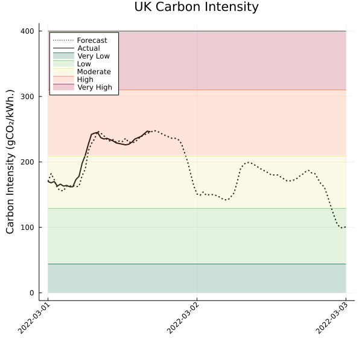
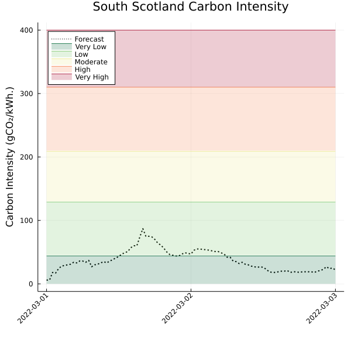

# UKCarbonIntensityData.jl

[](https://ianlmgoddard.github.io/UKCarbonIntensityData.jl/stable)
[](https://ianlmgoddard.github.io/UKCarbonIntensityData.jl/dev)
[](https://github.com/ianlmgoddard/UKCarbonIntensityData.jl/actions/workflows/JuliaNightly.yml?query=branch%3Amain)
[](https://codecov.io/gh/ianlmgoddard/UKCarbonIntensityData.jl)
[](https://github.com/invenia/BlueStyle)
[](https://github.com/SciML/ColPrac)


A Julia wrapper for the UK National Grid Electricity System operator (NG-ESO) [carbon intensity data API.](https://carbon-intensity.github.io/api-definitions/?python#carbon-intensity-api-v2-0-0)

## Examples

The Carbon intensity API lets us grab data at different spatial scales, either nationwide or regional, and over different time periods. The following examples show how we can use this package to retrieve data via the API. Note that the data has half hourly temporal resolution.

```Julia
using TimeZones
using DataFrames
using UKCarbonIntensityData
using Plots

start_date = ZonedDateTime(2022, 01, 01, tz"UTC")
end_date = ZonedDateTime(2022, 02, 28, tz"UTC")

# get national level intensity data for the given period
national_data = get_carbon_intensity(start_date, end_date)
```

We can also fetch data at the regional level, the `get_regional_data` function returns a `NamedTuple` with two fields. The fields contain a `DataFrame` of the forecast carbon intensity in each region, and the generation mix for the region respectively. Note that regional data is forecast only, ground truth values are not available via the NG-ESO API.
```Julia
regional_data = get_regional_data(start_date, end_date)
regional_intensity = regional_data.intensity;
regional_mix = regional_data.generation;
```

To grab the forecast for todays forecast and realised carbon intensities, we can use `get_todays_forecast`. By default this will return national level data, however we can pass the `regional` kwarg to return data with regional granularity.
```Julia
national_data = get_todays_forecast()

regional_data = get_todays_forecast(regional = true)
```

We can also use this package to visualise the current forecast and actual carbon intensity data over the next 48 hours. By default national data is shown. 
```
todays_plot()
```



To visualise the data for a specific region we can pass the `region` kwarg to the plot call.
```
todays_plot(region = "South Scotland")
```



